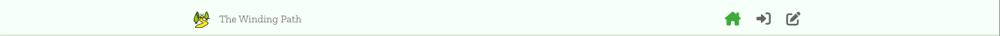
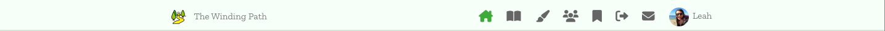
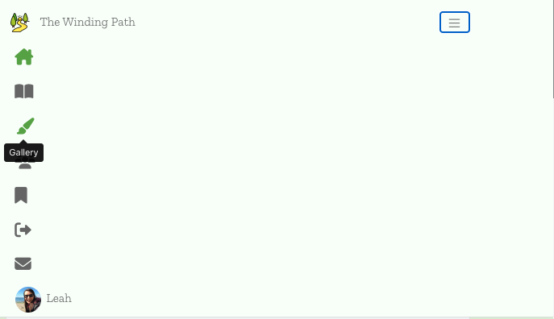
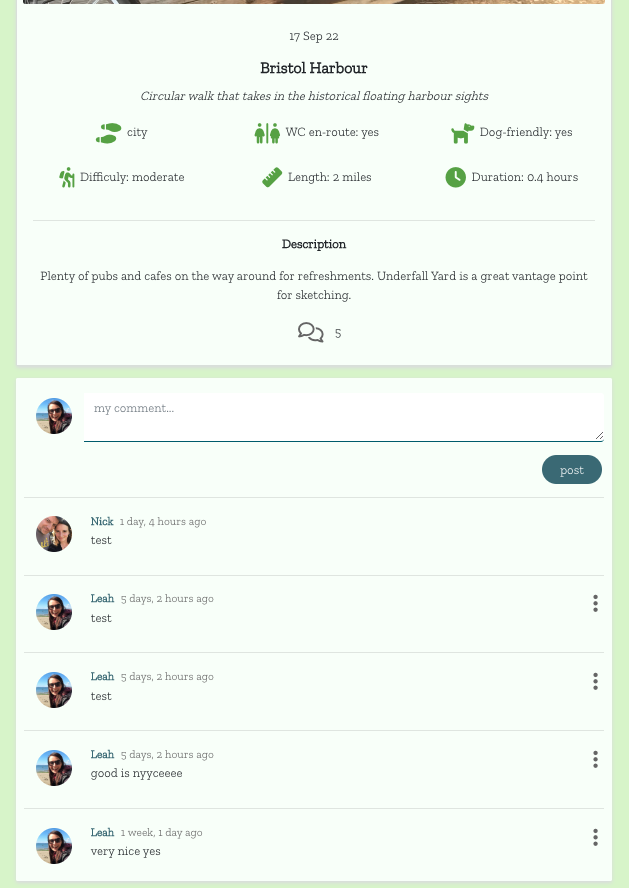
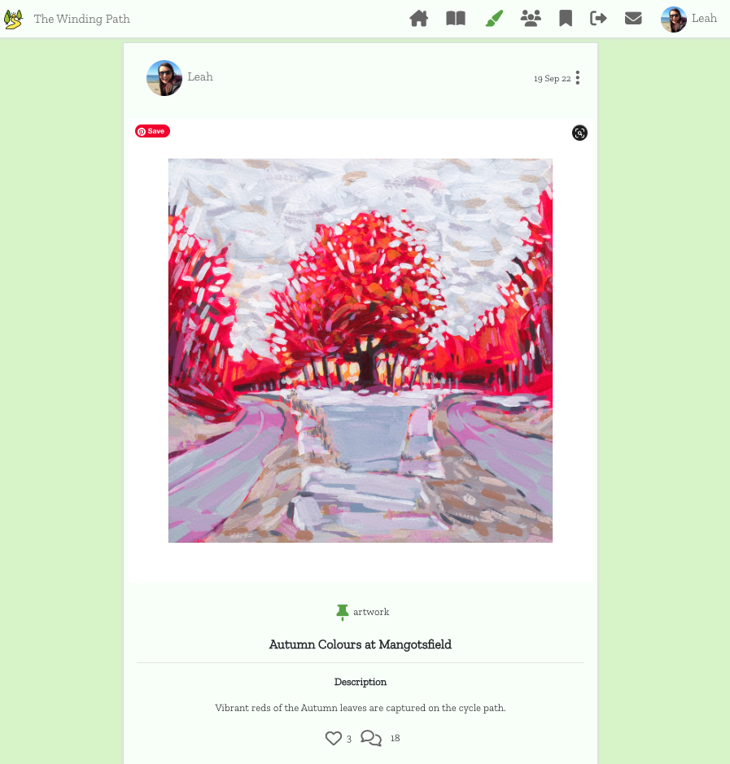
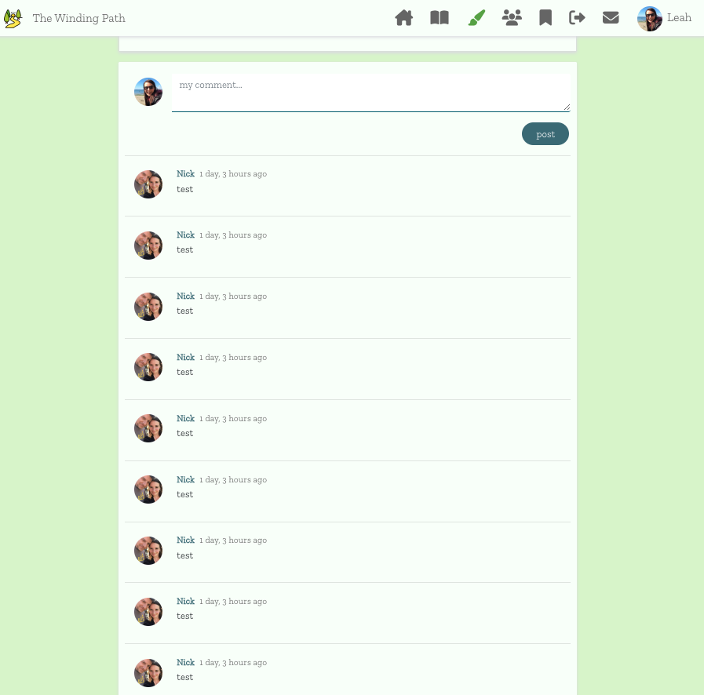
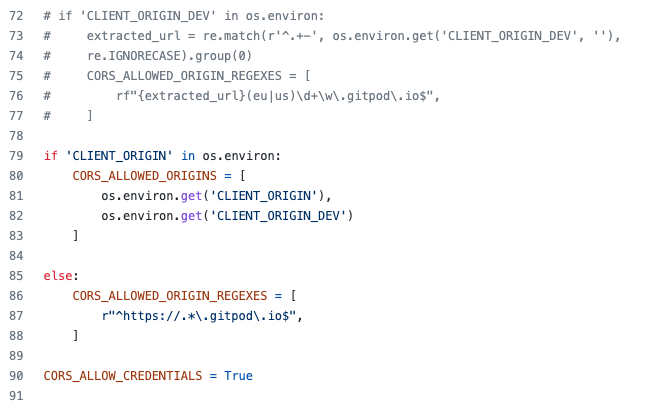

# Table of Contents

***

# Introduction

The Winding Path is a place where lovers of the great outdoors can post information about their favourite walks, and share artwork and photography inspired by the beautiful natural world they encounter.

Users can save their favourite walk posts and access them in a Saved Walks feed, as well as post comments on individual posts. Gallery posts can be liked and commented on too.

The Winding Path has been built using the Django Rest Framework (Python), React.js, Bootstrap.js, HTML, CSS & JavaScript. It provides user authentication and full CRUD functionality.

[Deployed DRF API (via Heroku)](https://the-winding-path-drf-api.herokuapp.com/)

[Deployed Front End](https://the-winding-path.herokuapp.com/)

[Back End README.md](https://github.com/cornishcoder1/pp5-backend-DRF-the-winding-path/blob/main/README.md)

[Back End TESTS.md](https://github.com/cornishcoder1/pp5-backend-DRF-the-winding-path/blob/main/TESTS.md)

***

# UX

## The Strategy Plane

This application has been produced for Portfolio Project 5, as part of the Code Institute Diploma in Full-Stack Software Development. The project aims to demonstrate skills learnt in HTML, CSS, JavaScript, React.js, Bootstrap.js and Django REST Framework.

## Agile Methodology

The development of this project was managed and implemented using GitHub Projects Kanban Board. Available here:
<a href="https://github.com/users/cornishcoder1/projects/2" target="_blank" rel="noopener" aria-label="Link to GitHub Projects">The Winding Path - User Stories</a>

 

## The Scope Plane

Features planned:

- Visually appealing design with a calming color scheme.
- Intuitive and easy to use navigation.
- Limited navigation for logged out users (full functionality available to logged in users).
- Walk posts - Logged in users can create, read, update and delete their own posts.
- Gallery posts - Logged in users can create, read, update and delete their own posts.
- Search Walk posts - Search by owner, title, environment or difficulty. 
- Search Gallery posts - Search by owner or title. 
- Comments - All posts can be commented upon. 
- Likes - Gallery posts can be likes.
- Save - Walk posts can be saved. 
- Users can sign up, log in and log out.
- Form errors will be communicated to user.

## The Structure Plane

Flowchart (This flowchart was drafted at the very early planning stages of the project and does not feature walk and gallery posts as separate entities):

Database Schema can be found in the README for the DRF API <a href="https://github.com/cornishcoder1/pp5-backend-DRF-the-winding-path/blob/main/README.md#database-schema---entity-relationship-diagram" target="_blank" rel="noopener" aria-label="Link to database schema">here</a>

## The Skeleton Plane

All wireframes for the project can be found [here](src/assets/wireframes/)

These wireframe were drafted at the very early planning stages of the project and may not feature all pages and their features. 

## The Surface Plane

**Color Scheme**

I wanted the main colours of the site to be calming and neutral, with a natural feel hence the use of the green and brown tones. Buttons were styled in bolder colors, but in keeping with the color scheme.

**Typography**

The font used throughout the website is 'Zilla Slab' from <a href="https://fonts.google.com/specimen/Zilla+Slab?preview.text=the%20winding%20path&preview.text_type=custom" title="Google Fonts">Google Fonts</a>. I liked the classic and sleek style of this font, and it fitted well with the theme of the application. 

***

# Features

## Components

Asset/Spinner:

This component is re-used in several parts of the application, wherever data is loading. It also appears for several seconds whilst data is fetched for a 'search posts' request. In this case, UX is improved as the feed does not refresh every time a character is typed into the search bar. 

Related user stories: 

***As a user I can search for gallery posts by owner or title so that I can find the content I am most interested in.***

***As a user I can search for walk posts by owner, title, environment or difficulty so that I can find the content I am most interested in.***

 

Avatar: 

This component is used in the navbar, post pages, 'Who to Follow' list and profile page. This component contributes to improved UX by allowing users to add a profile photo of their choice. It also allows other users to more quickly identify users they want to engage with.  

Related user stories:

***As a user I can access other users profiles so that I can view walk posts by a specific user.***

***As a user I can view stats on user profiles so that I can learn more about a specific user.***

***As a user I can access a list of ‘Who to Follow’ profiles so that I can see and interact with other users of the site and their content.***

 

MoreDropDown: 

This component is used in the post page, comments and profile. It improves UX by allowing users to access a dropdown menu to update/edit or delete their own data.

Related user stories:

***As a user I can edit my own walk posts so that I can update or change information.***

***As a user I can delete walk posts so that I can remove content that I no longer want on the application.***

***As a user I can edit my own gallery posts so that I can update or change information.***

***As a user I can delete gallery posts so that I can remove content that I no longer want on the application.***

***As a user I can edit my own comments so that I can update or change the content of my existing comments.***

***As a user I can delete my own comments so that I can remove comments that I no longer want on the application.***

***As a user I can access my own profile so that I can edit my details.***

***As a user I can change my username so that I can ensure security if required.***

***As a user I can change my password so that I can ensure security if required.***

 

NavBar: 

This component is present on every page of the application. It contributes to improved UX as the user can access most of the site features in one place, from any page. It also collapses into a hamburger menu for screen sizes medium and below.

Related user stories:

***As a user I can view the navigation bar on every page so that I can navigate easily around the application.***

 

NotFound: 

This component appears whenever a user tries to access an invalid url. It contributes to improved UX as the user is informed clearly and quickly that the page they are looking for does not exist. 

Related user stories:

***As a user I can view the navigation bar on every page so that I can navigate easily around the application.***

 

## Pages

Sign up: 

Related user stories:

***As a user I can access the Sign Up option so that I can create an account and access all features available to signed up users.***

 

Log in: 

Related user stories:

***As a user I can log in with my authentication credentials so that I can access all features available to signed up users.***

 

Home, Following & Saved Walks pages: 

Related user stories:

***As a user I can add walk posts so that I can share my walking experiences with other users.***

***As a user I can read a walk post so that I have access to all the information within that post***

***As a user I can access a list of ‘Who to Follow’ profiles so that I can see and interact with other users of the site and their content.***

***As a user I can access a ‘Following’ feed , so that I can view content filtered by what profiles I follow.***

***As a user I can save walk posts that are of particular interest, so that I can find them again later in my ‘Saved Walks’ feed.***

***As a user I can view all posts and comments in date order (descending) so that I can quickly see the most recent content.***

***As a user I can search for walk posts by owner, title, environment or difficulty so that I can find the content I am most interested in.***

 

Gallery: 

Related user stories:

***As a user I can add gallery posts so that I can share my artwork or photography with other users.***

***As a user I can read a gallery post so that I have access to all the information within that post***

***As a user I can like other users gallery posts so that I can show my appreciation for other users content.***

***As a user I can see how many likes a gallery post has had so that I can gauge it’s popularity.***

***As a user I can view all posts and comments in date order (descending) so that I can quickly see the most recent content.***

***As a user I can search for gallery posts by owner or title so that I can find the content I am most interested in.***

 

Add/Edit Walk post pages: 

Related user stories:

***As a user I can add walk posts so that I can share my walking experiences with other users.***

***As a user I can edit my own walk posts so that I can update or change information.***

 

Add/Edit Gallery post pages: 

Related user stories:

***As a user I can add gallery posts so that I can share my artwork or photography with other users.***

***As a user I can edit my own gallery posts so that I can update or change information.***

 

Walk Post: 

Related user stories:

***As a user I can read a walk post so that I have access to all the information within that post.***

***As a user I can delete walk posts so that I can remove content that I no longer want on the application.***

***As a user I can comment on walk and gallery posts so that I can communicate my thoughts and opinions with other users.***

***As a user I can read comments on walk and gallery posts so that I can see the thoughts and opinions of other users.***

***As a user I can edit my own comments so that I can update or change the content of my existing comments.***

***As a user I can delete my own comments so that I can remove comments that I no longer want on the application.***

 

Gallery Post:

Related user stories:

***As a user I can read a gallery post so that I have access to all the information within that post.***

***As a user I can delete gallery posts so that I can remove content that I no longer want on the application.***

***As a user I can comment on walk and gallery posts so that I can communicate my thoughts and opinions with other users.***

***As a user I can read comments on walk and gallery posts so that I can see the thoughts and opinions of other users.***

***As a user I can edit my own comments so that I can update or change the content of my existing comments.***

***As a user I can delete my own comments so that I can remove comments that I no longer want on the application.***

 

About: 

Related user stories:

***As a user I can access an 'about' page so that I can find out more about the application.***

 

Contact Us/Confirmation: 

Related user stories:

***As a user I can fill out and submit a contact form so that I can make admin aware of any issues or feedback.***

 

Profile: 

Related user stories:

***As a user I can access other users profiles so that I can view walk posts by a specific user.***

***As a user I can view stats on user profiles so that I can learn more about a specific user.***

***As a user I can access my own profile so that I can edit my details.***

***As a user I can change my username so that I can ensure security if required.***

***As a user I can change my password so that I can ensure security if required.***

 

## Features left to implement (possible future sprints): 

- Add modals for further user feedback.
- Expand on the data fields available, so that walk posts can be more detailed (eg. implement Google Maps or What3Word functionality to give more precise location information).
- Expand category choices for Gallery posts. 
- Allow walk tracking functionality (similar to sites like <a href="https://www.komoot.com/" target="_blank" rel="noopener" aria-label="link to Kamoot">Kamoot)</a>. 

***

# Testing

- All testing documentation can be found [here](/TESTS.md)

***

# Bugs

## Fixed

1. When Creating a walk post, the choice fields on the form could be left at their default values with the form submitting without any problems. However, in the walk post edit form an error would be thrown on submission if these fields were not updated by the user. The error message was "'unknown' is not a valid option", despite it being listed as an option on the form and in WalkPostCreateForm.js and WalkPostEditForm.js. After several attempts to fix this bug by modifying code in the backend, I realised the value 'unknown' was missing from the choice arrays in the Walk Post model. I added this value to the relevant arrays, migrated the changes to the database and performed a Git add, commit and push. I then created a new post, went to the edit form and submitted without changing the relevant choice fields. The form submitted and updated successfully with no errors shown.

2. When creating a gallery post I found that if the category field was left at it's default value 'Artwork' and the create form was then submitted, the value for 'Category' in the gallery post would show as '0':

This bug was fixed by changing the 'default' value for the category field from '0' to 'artwork' in the DRF API Gallery model. Once this was changed, the default value of 'artwork' would show in the post if not changed by the user. 

3. When testing the deployed application, I noticed that posts were not displaying at the top of the posts feed after being updated (for both walk and gallery posts). I fixed this in the DRF API by changing the 'ordering' value in the models.py file to 'updated_on' instead of 'created_on'. I also had to make the same changes to any 'ordering' values in the views.py file. I made these changes for both gallery and walk posts.  

## Unfixed

No notable bugs have been found to remain and the website functions as expected.

***

# Technologies Used

## Modules
Modules used in this project can be found in the README for the DRF API <a href="https://github.com/cornishcoder1/pp5-backend-DRF-the-winding-path/blob/main/README.md#modules" target="_blank" rel="noopener" aria-label="Link to modules used">here</a>

## Languages
- HTML
- JSX
- CSS
- JavaScript

## Frameworks, Libraries and Platforms used (Front End)
- Django REST Framework - Backend API.
- React.js - Components and pages to form the frontend of the application.
- React Bootstrap.js - Provides a library of out-of-the box components that contribute towards optimised UX. 
- Balsamiq - Creation of wireframes. 
- GitPod - Workspace.
- GitHub - Repository hosting.

## Services
- [AmIResponsive](https://ui.dev/amiresponsive) - Check responsiveness on all screen sizes. 
- [Coolors.co](https://coolors.co/) - Presentation of colors for README
- [DrawSQLapp](https://drawsql.app/) - Development of database schema
- [Favicon](https://favicon.io/) - Generation of favicon
- [FontAwesome](https://fontawesome.com/) - Icons used for UX purposes
- [GoogleFonts](https://fonts.google.com/) - 'Zilla Slab' font used throughout site
- [LucidChart](https://www.lucidchart.com/) - Development of flowchart
- [Mycolor.space](https://mycolor.space/) - Generation of color palettes

## Resources

- The Code Institute's Moments walkthrough project was used in the beginning stages of the project to help get me started. I then customised and added further functionality as my confidence and knowledge grew.
- React Bootstrap documentation was relied upon for assistance with page layouts and components. 
- W3C Schools and Stack Overflow for general enquiries relating to React.js.

***

# Project Setup and Initial Deployment

1. Create a new repository in GitHub (do not use CI Template).

2. Create new workspace by clicking 'Gitpod' button. 

3. Once workspace has loaded, run terminal command **npx create-react-app . --use-npm** to create React app. 

4. Once the app is installed, run terminal command **npm start** to check app is working. Browser should open with the spinning React logo on a dark blue background. 

5. Remove logo import from the top of App.js, and replace the React Header element with a custom h1 element containing 'Hello World!'. 

6. Confirm the changes have rendered in the browser preview then add, commit and push changes. 

7. Create a new app in Heroku. 

8. Go to 'Settings' and ensure that **heroku/nodejs** buildpack is present. If it is not, click on 'Add Buildpack', select 'nodejs' and save changes.

9. Click on the 'Deploy' tab and go to 'Deployment Method'. Click on GitHub. 

10. Go to 'App connected to GitHub' and search for the relevant repository. Select that repository and click 'Connect'.

11. Go to 'Manual Deploy' section and click 'Deploy Branch'. Click on 'build logs' to monitor build and ensure deployment is successful. Build is complete when log states 'Build succeeded!'. 

12. Click 'Open App' button to view newly deployed app. 

13. To install Bootstrap, run terminal command **npm install react-bootstrap@1.6.3 bootstrap@4.6.0**

***

# Final Deployment

1. **IMPORTANT** In setting.py in the DRF API, make sure that the 'CLIENT_ORIGIN_DEV' if statement is commented out, and the 'CLIENT_ORIGIN if statement is present (not the other way around): 

2. Ensure all finalised code is commited and pushed to github. 

3. Log into Heroki and open the dashboard for your frontend react application.

4. Select the “Deploy” tab in the dashboard and select "Deploy Branch".

5. Wait for the build to complete (you can click “view build log” to watch the process in a larger window).

6. When you see the message “deployed to Heroku” in the build log, click the “open app” button at the top of the page.

7. Test the deployed application to ensure it matches the development version. 

***

# Credits

## Media

- Trail icon by <a href="https://www.flaticon.com/free-icon/path_2296506?term=trail&page=1&position=8&page=1&position=8&related_id=2296506&origin=tag" title="Smashicons">Smashicons</a> on <a href="https://www.flaticon.com/" title="Flaticon">Flaticon</a>

- Image upload icon by <a href="https://www.flaticon.com/free-icon/path_2296506?term=trail&page=1&position=8&page=1&position=8&related_id=2296506&origin=tag" title="Good Ware">Good Ware</a> on <a href="https://www.flaticon.com/" title="Flaticon">Flaticon</a>

- No results icon by <a href="https://www.flaticon.com/free-icon/no-results_6134051?term=no%20results&page=1&position=29&page=1&position=29&related_id=6134051&origin=tag" title="Freepik">Freepik</a> on <a href="https://www.flaticon.com/" title="Flaticon">Flaticon</a>

- Peak/Hill image by <a href="https://unsplash.com/@nick_" title="Nicholas Beel"> Nicholas Beel</a> on <a href="https://unsplash.com/" title="Unsplash">Unsplash</a>

- Whiskey image by <a href="https://unsplash.com/@disguise_truth" title="Anastasia Zhenina"> Anastasia Zhenina</a> on <a href="https://unsplash.com/" title="Unsplash">Unsplash</a>

- Gallery post artwork by <a href="https://www.nickgerolemou.co.uk/" title="Nick Gerolemou"> Nick Gerolemou</a>

- All other photographs on application at time of submission taken by Leah_Fisher_5P or supplied by other users. 

***

# Credits

- Charlie_Alumni, Bim_Alumni and Lauren_Nicole for helping me install ESLint correctly. 
- Lauren_Nicole for the chats and support. Also for supplying her own React Front End PP5 for reference. 
- Alan at Tutor Support for helping me with final deployment. 
- The Slack Community for an invaluable archive of help! 

