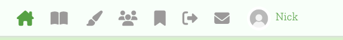
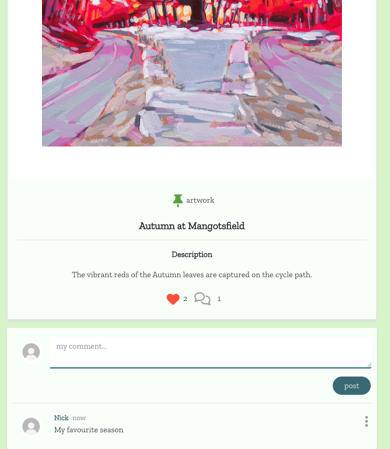
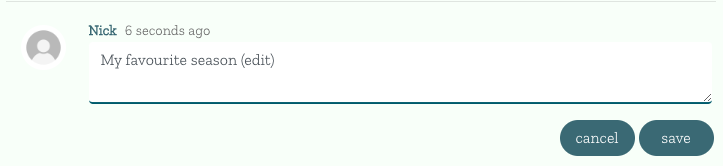
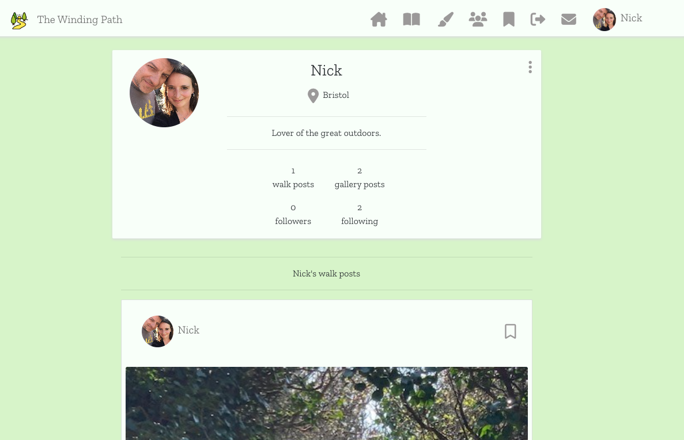
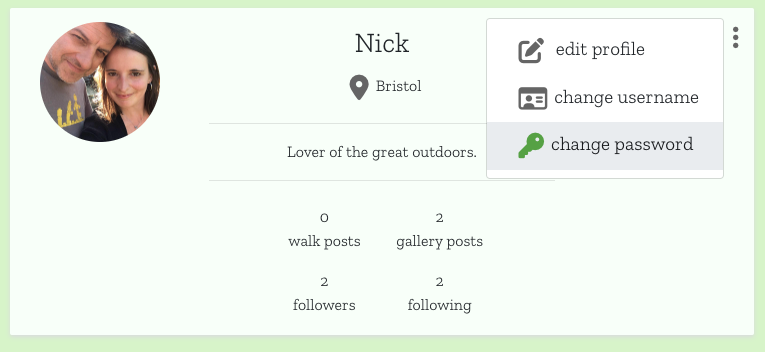
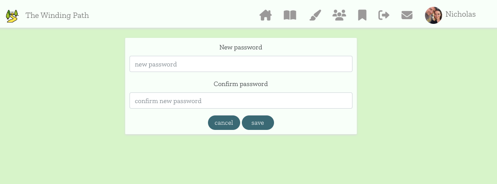

## Table of contents

1. [User Story testing](#user-story-testing)
    1. [User Story tests](#user-story-tests)
    2. [Testing summary](#testing-summary)

2. [Validator Testing](#validator-testing)
    1. [ES Lint](#es-lint)
    2. [W3C CSS](#w3c-css)
    3. [Lighthouse](#lighthouse)

3. [Responsive Testing](#responsive-testing)

***

# User Story Testing

# User Story Tests

## As a user I can view the navigation bar on every page so that I can navigate easily around the application.


Logged out navigation bar: 


Logged in navigation bar: 


Hamburger menu for screensizes medium and below: 


<br>

## As a user I can access the Sign Up option so that I can create an account and access all features available to signed up users.


Link to sign up form present in navbar:


Upon submitting Sign Up form, user is re-directed to log in page:


The newly created Profile has been sent to the DRF API: 


<br>

## As a (returning) user I can log in with my authentication credentials so that I can access all features available to signed up users.


Link to log in form present in navbar: 


Upon logging in, all functionality is available to logged in user (full navigation bar and add post links in Walks Post Page and Gallery Posts Page):


<br>

## As a (logged in) user I can access the log out option in the navbar so that I can log out of my account.


Link to Log out displays if user is logged in: 


<br>

## As a user I can see my authentication status so that I know whether or not I need to log in.


User's avatar and username display in navigation bar if user is logged in: 



Avatar and username link to profile of logged in user: 


<br>

## As a user I can add walk posts so that I can share my walking experiences with other users.


The following link is present on Home, Following and Saved Walks pages:


The user is taken to the Add Walk Post form:


After clicking the 'Create' button, the form data is sent to the DRF API, and the Walk Post displays on the Home page with all form data present (the cancel button returns the user to the Home page): 


<br>

## As a user I can read a walk post so that I have access to all the information within that post


Users can click into a post from the Home, Following or Saved Walks page feeds and view all post details as well as the comments area: 


<br>

## As a user I can edit my own walk posts so that I can update or change information.


After clicking into the Walk Post, the user can access the edit button via a dropdown menu:


After clicking the edit button, the user is taken to the edit form, where they can change or update all fields:


Upon clicking the 'update' button, the user is taken back to the post with the relevant fields now updated (the cancel button returns the user to the post in it's previous state): 


<br>

## As a user I can delete walk posts so that I can remove content that I no longer want on the application.


Upon clicking the 'delete' button the post is deleted from the application and the DRF API, and the user is returned to the page they were previously on: 


<br>

## As a user I can add gallery posts so that I can share my artwork or photography with other users.


The following link is present on the Gallery page:


The user is taken to the Add Gallery Post form:


After clicking the 'Create' button, the form data is sent to the DRF API, and the Gallery Post displays on the Gallery page with all form data present (the cancel button returns the user to the Gallery page): 


**Bug Detected! See no.2 in 'Fixed Bugs' section of README**

<br>

## As a user I can read a gallery post so that I have access to all the information within that post


Users can click into a post from the Gallery page feed and view all post details as well as the comments area: 



<br>

## As a user I can edit my own gallery posts so that I can update or change information.


After clicking into the Gallery Post, the user can access the edit button via a dropdown menu:


After clicking the edit button, the user is taken to the edit form, where they can change or update all fields:


Upon clicking the 'update' button, the user is taken back to the post with the relevant fields now updated (the cancel button returns the user to the post in it's previous state): 


<br>

## As a user I can delete gallery posts so that I can remove content that I no longer want on the application.


Upon clicking the 'delete' button the post is deleted from the application and the DRF API, and the user is returned to the page they were previously on: 


<br>

## As a user I can like other users gallery posts so that I can show my appreciation for other users content.

## As a user I can see how many likes a gallery post has had so that I can gauge it’s popularity.


Users can click the 'like' heart button on any gallery post (in the posts feed or specific post) to like or unlike a post. The visible like count will increase or decrease on each post when a user likes/unlikes:


<br>

## As a user I can comment on walk and gallery posts so that I can communicate my thoughts and opinions with other users.


## As a user I can read comments on walk and gallery posts so that I can see the thoughts and opinions of other users.


Any post (gallery or walk) can be clicked into, and a comment form can be accessed beneath the main post body:


After the 'post' button is clicked, the comment shows in a list beneath the main post body: 


<br>

## As a user I can edit my own comments so that I can update or change the content of my existing comments.


A dropdown menu is present on a logged in user's own comments with an edit button: 


When the edit button is clicked, an edit form opens on the comment: 



When the 'save' button is clicked, the updated comment displays in the comment list: 


<br>

## As a user I can delete my own comments so that I can remove comments that I no longer want on the application.


A dropdown menu is present on a logged in user's own comments with a delete button: 


When the delete button is clicked, the comment disappears from the list. 

<br>

## As a user I can access a list of ‘Who to Follow’ profiles so that I can see and interact with other users of the site and their content.


The 'Who to follow' list displays on the home, following and saved walks pages. Users can follow/unfollow a profile by clicking it's corresponding button:  


A follow/unfollow button is also available in the Profile page: 


<br>

## As a user I can access a ‘Following’ feed , so that I can view content filtered by what profiles I follow.


Link to Following feed/page is present in the navbar (when clicked the user is taken to a feed of walk posts filtered by user profiles that they are following):


<br>

## As a user I can save walk posts that are of particular interest, so that I can find them again later in my ‘Saved Walks’ feed.


A (bookmark) save button is present at the top of every walk post. When clicked, the bookmark turns green and the post is added to the user's Saved Walks feed:


The Saved Walks feed is accessible for the navigation bar: 


<br>

## As a user I can access other users profiles so that I can view walk posts by a specific user.


## As a user I can view stats on user profiles so that I can learn more about a specific user.


Profiles can be clicked into via profile name/avatar on the 'Who to Follow' list: 


Upon being clicked into, the Profile page shows the user's location, bio and stats and a list of their walk posts:


<br>

## As a user I can access my own profile so that I can edit my details.


A dropdown menu is present in a user's own profile with an edit button: 


After clicking the edit button, the user is taken to the edit form, where they can change or update all fields:


When the 'save' button is clicked, the user is returned to their updated profile:



<br>

## As a user I can change my username so that I can ensure security if required.


A dropdown menu is present in a user's own profile with a 'change username' button:


After clicking the 'change username' button, the user is taken to a form where they can change their username:


An error message appears if invalid characters are used: 


Upon entering a valid username, and clicking the 'save' button, the user is returned to their updated profile (the cancel button takes the user back to their profile in it's original state):


<br>

## As a user I can change my password so that I can ensure security if required.


A dropdown menu is present in a user's own profile with a 'change password' button:



After clicking the 'change password' button, the user is taken to a form where they can change their password:



An error message appears if invalid characters are used: 


Upon entering a valid password, and clicking the 'save' button, the user is returned to their profile (clicking the cancel button retains the original password).

<br>

## As a user I can view all posts and comments in date order (descending) so that I can quickly see the most recent content.


All posts are listed in date order of when they were last updated (most recent first).
**Bug Detected! See no.3 in 'Fixed Bugs' section of README**

All comments are listed in order of when they were created (last updated status displays within the comment in days, hours and minutes format): 


<br>

## As a user I can search for walk posts by owner, title, environment or difficulty so that I can find the content I am most interested in.


Search bar is present on Home, Following and Saved Walks pages. Searching by owner, title, environment or difficulty has been tested and posts are filtered correctly. 

## As a user I can search for gallery posts by owner or title so that I can find the content I am most interested in.


Search bar is present on Gallery page. Searching by owner or title has been tested and posts are filtered correctly. 

<br>

## As a user I can fill out and submit a contact form so that I can make admin aware of any issues or feedback. 


Link to contact form is present in navbar: 


Upon clicking the link the user is taken to a contact form: 


Error messages will show if the form is not completed correctly:


Upon clicking the 'submit' button, the user is taken to a confirmation page: 


The form data is then submitted to the DRF, and is accessible in the admin panel: 


<br>

## As a user I can access an 'about' page so that I can find out more about the application.


The about page is accessible via a navigation bar link: 


# Testing summary 

- All authentication functionality has been tested and behaves as expected. 

- The navigation bar contains all required icons and overlay/tooltips which link to the correct pages. 

- The hamburger menu for screen sizes medium and below contains all required icons and overlay/tooltips which link to the correct pages. 

- CRUD functionality behaves as expected for Walk posts, Gallery posts and comments. 

- Like functionality for Gallery posts works as expected. 

- The 'Who to Follow' list displays on the correct pages, and the follow/unfollow functionality behaves as expected. 

- The following feed filters the returned walk post data correctly. 

- Save functionality for Walk posts works as expected, and the saved walk posts feed filters the returned walk post data correctly. 

- The profile page displays all profile data as expected. 

- CRUD functionality behaves as expected for updating Profiles, Username and Password. 

- All posts display in ascending order of when they were last updated. 

- All search bars return the correctly filtered post data. 

- The contact form sends data to the DRF API as expected.

- All URLS have been tested. If a logged out user attempts to access a url only available to a logged in user, they are directed away from the restricted page. Likewise, logged in users cannot access edit forms for other user's data. 

***

# Validator testing

## ES Lint

The following errors were detected by ES Lint: 

1. "{prop}is missing in props validation" - ES Lint identified this error across a number of js files. The following solution suggested by sean_ci on Slack was used to stop these errors from appearing: 


2. "Component definition is missing display name" - This error related to the 'ThreeDots' component in MoreDropDown.js. The following solution given by <a href="https://stackoverflow.com/users/3617886/tholle" title="Tholle">Tholle</a> on <a href="https://stackoverflow.com/questions/52992932/component-definition-is-missing-display-name-react-display-name" title="Stackoverflow">Stackoverflow</a> was used to rectify this error: 


3. "Do not pass children as props" - This error has been intentionally ignored as it is in relation to code that was provided in the Moments Walkthrough project. I have added ```/*eslint-disable*/``` to the top of the js files concerned and have also listed them in the .eslintignore file.  

## W3C CSS

All CSS code passed through the validator with no issues: 


## Lighthouse

The site scored highly on accessibility: 


***

# Responsive Testing

The website has been tested using the following browsers:

- Google Chrome
- Microsoft Edge
- Mozilla Firefox
- Safari

The website has been tested on the following devices: 

- MacBook Air
- Dell Latitude 5300
- iPhone SE 2020

The following emulated devices have been tested in Dev Tools:

- iPhone XR
- iPhone 12 Pro
- Pixel 5
- Samsung Galaxy S20 Ultra
- iPad Air
- iPad Mini
- Galaxy A51/71 

During testing it was found that users are unable to log in if using Firefox and Safari. It was suggested by a fellow student on Slack that this may be because third party cookies are being blocked, however no solution was provided. 

The only layout issue encountered was that the 'About' page had some excess whitespace at the bottom on some smaller screen sizes.